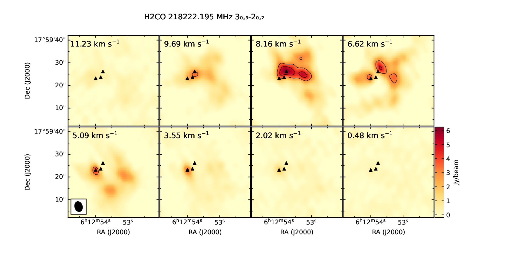

# S255IR data processing

Here are the scripts for data processing and map construction for the paper [Multi-frequency mapping of the S255IR region at a wavelength of 1.3 mm
E. A. Mikheeva, S. V. Kalenskii, A. M. Sobolev, and S. Kurtz, Astronomy Reports, 2026](https://arxiv.org/abs/2602.14956)

The `data/` and `outputs/` folders contain example files.
All processed data files are available on the website: http://www.asc.rssi.ru/kalenskii/s255ir/s255ir.html


## Dependencies

The scripts were tested with Python 3.12.3. All required libraries are listed in `requirements.txt`. You can install them using:

```bash
pip install -r requirements.txt
```

The scripts will likely work with other Python versions and library versions as well, but for full reproducibility, it is recommended to use the specified versions.

## Overview of the data processing pipeline

The overall data processing procedure was as follows:

0. Obtain raw data from the SMA database in Measurement Set format
1. Split the data into 24 chunks (or spw) using pyuvdata
2. Calibration of the data
3. Continuum subtraction
4. Convert the data from Measurement Set to image format (suitable for viewing in CASA or CARTA) using tclean niter=0
5. tclean (rough cleaning in non-iterative mode), mask (see `data/raw/regions/forcleaning.reg`)
6. Construct a preliminary spectrum averaged over the region defined in `data/raw/regions/region_prior.reg`
7. Identify the strongest lines in CLASS and construct preliminary maps for them
8. Select maps for manual cleaning
9. tclean (in non-iterative mode). A region of 15′′ × 12′′ around SMA1 was selected for cleaning
10. Extract spectra toward SMA1 and SMA2
11. Construct rotational diagrams for SMA1
12. Manual cleaning and construction of selected maps, plus maps for weaker lines (those we decided to construct after inspecting the spectra)
13. Construct channel maps
14. Construct rotational diagrams for Met1 and Met2

Details for each step are provided below.

## Splitting data into 24 chunks (spw) using pyuvdata

Place the downloaded file in `data/raw/201006_14_32_20`

The script `src/pyuvdata_extract_ms.py` is used for splitting into chunks.

`sidebands=` can be 'u' or 'b' (for 'up' and 'bottom')

`receivers=` can be '230' or '240'

Each band was further divided into six 2.28 GHz spectral windows with overlapping edges.

Thus, there are 6 corrchunks in each configuration.

## Calibration

Visibility calibration was performed following the SMA antenna array calibration manual (https://lweb.cfa.harvard.edu/rtdc/SMAdata/process/tutorials/sma_in_casa_tutorial.html).
Bandpass calibration was performed using the quasar 3C84. The point sources 0423−013 and 0510+180 were used as phase calibrators. Flux calibration was performed using the Solar System objects Vesta and Uranus.

## Continuum subtraction

For each spw, the continuum was subtracted using the following command:

```
uvcontsub(vis="spw1.ms", field='0', fitspec="0:53~185; 1019~1051; 1176~1210; 1579~1673; 1725~1797", fitorder=0, outputvis='spw1.contsub')
```

The `fitspec` values for all spw are listed in `data/intermediate/cont_subtraction.txt`

## tclean (rough cleaning in non-iterative mode)

Example command:

```
tclean(vis='s255irOct_240_10.ms', selectdata=True, imagename='s255_240spw10', imsize=[100], cell=['0.5arcsec'], specmode='cube', niter=4000, mask='forcleaning.reg')
```

## Extracting spectra from cubes

1. **Load the data**:
   ```bash
   # In the CASA terminal:
   imview
   ```

2. **Extract the spectrum**:
   - Load the image in CASA: `spw0.image`
   - Load the region for which you need the spectrum
   - Open the Spectral Profile Tool (the icon with the z-spectrum)
   - Save as FITS

3. **Data processing**:
   - Manually replace all commas with dots in the FITS headers (e.g., using fv FITS Editor; the script cannot handle this)
   - Run: `add_lines_to_header.py` (All files must be specified inside the script)
   - Run: `for_class_header_fix.py` (generates terminal commands)

## Constructing rotational diagrams (RD)

### Data sources:

- **Catalog lines**: https://spec.jpl.nasa.gov/ftp/pub/catalog/catdir.html
  - Save to: `data/catalogues` (needed for `lgint` and `Elow`)
- **Search for transitions**: https://pml.nist.gov/cgi-bin/micro/table5/start.pl
  - Frequency range: 209.385 - 249.682 GHz
  - Select the desired molecule
  - Output format: Plain Text
  - Uncheck unnecessary columns

### Procedure:

1. **Prepare the lines**:
   - Copy the lines to `data/intermediate/lines_sma1/H2CO_lines.txt` (or to a file for the molecule of interest)
   - Remove the second line (part of the header)
   - Replace delimiters with tabs

2. **Analyze the lines**:
   
Remember to change the molecule name in the script
Run:
   `src/RD/plots_for_RD.py`
   
   This script will plot the spectral ranges where the lines listed in H2CO_lines.txt should appear. It will show the first 16 and ask whether each line is suitable. The answers will be written to the same H2CO_lines.txt file as a third column.

3. **Process the lines**:
   - If a line is visible in the spectrum, it can be fitted in CLASS or with a separate script to obtain the parameters of a Gaussian fitted to the line.
   - Use the Gaussian parameters to construct a rotational diagram.

## Manual cleaning of maps

### Spectral windows (SPW)

| SPW | Range (GHz)   | SPW | Range (GHz)   | SPW | Range (GHz)   | SPW | Range (GHz)   |
|-----|---------------|-----|---------------|-----|---------------|-----|---------------|
| spw0 | 209.385–211.672 | spw12 | 217.385–219.672 | spw6 | 229.384–231.671 | spw18 | 237.384–239.671 |
| spw1 | 213.684–211.397 | spw13 | 221.684–219.397 | spw7 | 233.683–231.396 | spw19 | 241.683–239.396 |
| spw2 | 213.385–215.672 | spw14 | 221.385–223.672 | spw8 | 233.384–235.671 | spw20 | 241.683–243.396 |
| spw3 | 217.684–215.397 | spw15 | 225.684–223.397 | spw9 | 237.683–235.396 | spw21 | 245.683–243.396 |
| spw4 | 217.385–219.672 | spw16 | 225.684–227.397 | spw10 | 237.384–239.671 | spw22 | 245.384–247.670 |
| spw5 | 221.684–219.397 | spw17 | 229.683–227.397 | spw11 | 241.683–239.396 | spw23 | 249.682–247.396 |

### Step-by-step instructions:

1. **Determine the SPW (two options)**:
   - Use the table above to find which SPW contains the frequency range of interest
   - Alternatively: enter the frequencies in `src/find_spw/lines_to_spw.txt` and run `src/find_spw/line_to_spw.py`. The results will be in `data/intermediate/line_to_spw_mapping.txt`.

2. **Find the channels**:
   ```bash
   # Place the files in `data/intermediate/images/casa_files/`
   # Open the dirty maps in CARTA
   # Find the frequency range of interest and write the channel numbers in `data/intermediate/molecules.csv` as follows:
   molecule,frequency,spw_file_number,channel_start,channel_end
   CH2CO, 224327.250, 15, 1212, 1224
   g-CH3CH2OH, 243120.317, 20, 1543, 1558
   ```

3. **split and tclean in CASA**:
   Run `src/make_casa_commands.py`. This script will generate `data/intermediate/split.txt` and `data/intermediate/tclean.txt` from `data/intermediate/molecules.csv`. These files contain commands for extracting the relevant channels and for manual cleaning with tclean. Start CASA. The split commands can all be run at once, but the tclean commands must be run one by one.

## Creating integrated maps

1. **Convert to FITS**:
   ```python
   # In CASA, run:
   exec(open("Image_to_fits.py").read())
   ```
   This script will convert all image‑format files to FITS and place them in the same folder where the image files were located. If such files already exist, the script will not overwrite them.

2. **Create the integrated file**:
   ```python
   # Run the script (no input required):
   integrate_fits.py
   ```

3. **Configure and plot maps for the paper**:
   - Edit the configuration for `line_sets.py`, i.e., `src/plotting_map_set/config.py`
   - Enter the required information about the transition
   - Transitions can be found at: https://pml.nist.gov/cgi-bin/micro/table5/start.pl
   - Run `src/plotting_map_set/line_sets.py`
   - Results will be in `outputs/map_sets/`

## Creating channel maps

   - Run `channel_maps.py`
   - Parameters can be changed in `src/config.py` in the CHANNEL_MAP_PARAMS section
   - Results will be in `outputs/channel_maps_pdf/`

## Creating maps for the website

   - Run `plot_pdf_from_fits.py` (the results will be in `data/integrated_maps`)
   - Results will be in `outputs/integrated_maps/`
   - Run `prepare_for_web.py`
   - Results will be in `outputs/web/`
   - Edit the configuration manually. This is best done by hand. The configuration helps avoid losing files across different computers.
   - Run `update_header_RESTFRQ.py`. It will report which files are missing.
   - Run `generate_html.py`

## Creating spectra plots for the paper

   - Run `Spectra_plot.py`
   - Results will be in `outputs/figures/`

---

Happy mapping!



